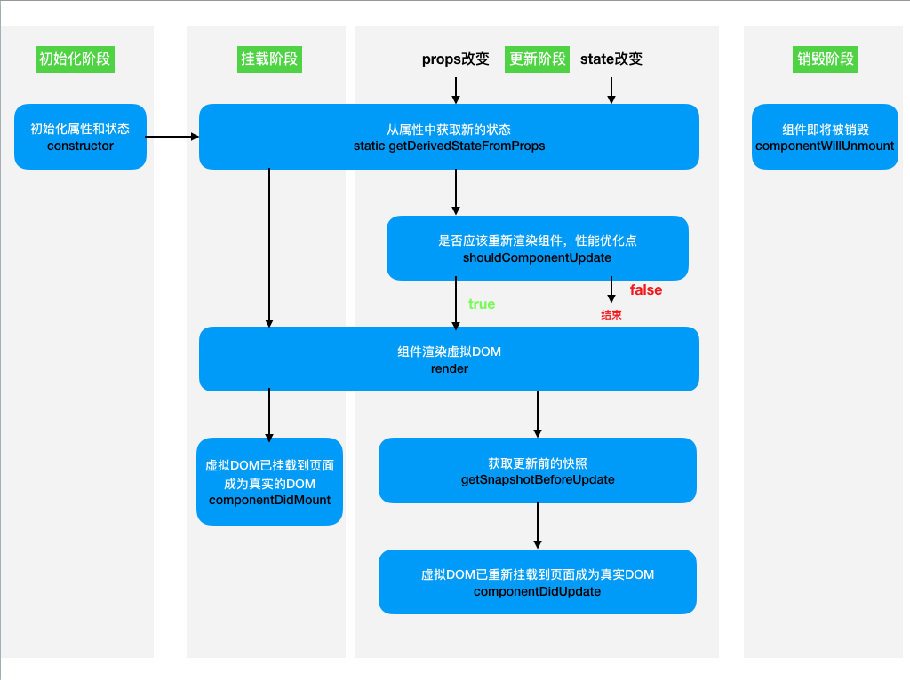

# React-Notes
React Family Meals.


## React 核心概念


### JSX


#### JSX是什么？

- Fackbook起草的JS扩展语法
- 本质是一个JS对象，会被babel编译，最终会被转换为`React.createElement`
- 每个JSX表达式，有且仅有一个根节点
  - React.Fragment（空节点相当于`<></>`）
- 每个JSX元素必须结束（XML规范）


```jsx
<div className="App">
  <h1>hello</h1>
  
</div>
```


#### 在JSX中嵌入表达式

- 将表达式作为内容的一部分
  - false，null和undefined不会显示
  - 普通对象不可作为子元素
  - 可以放置React元素对象
- 将表达式作为元素属性
- 属性使用小驼峰命名法
- 防止注入攻击
  - 自动编码
  - `dangerouslySetInnerHTML`

使用：

```jsx
function Me() {
  const person = { name: 'Flinn', friends: ['Leon', 'Monica'] }
  return (
    <div className="App">
      <h1>hello</h1>
      name: {person.name}
      <br />
      friends:
      <ul>{ person.friends.map(friend => <li>{friend}</li>) }</ul>
    </div>
  )
}
```

通常情况下，为防止注入攻击，React使用innerText进行页面的渲染，如有特殊需求，可使用`dangerouslySetInnerHTML`改为innerHTML：

```jsx
function App() {
  const content = '<h1>dangerous!!!</h1>'
  return (
    <div className="App" dangerouslySetInnerHTML={{__html: content}}>
    </div>
  )
}
```


#### 元素的不可变性


```jsx
const person = { name: 'Flinn', age: 21 }
const Person = (
  <div>
    {person.name}
    {person.age}
  </div>
)

// 报错：jsx对象上的属性是只读的
// 原理：Object.freeze(Person)
// 哲学：不断创建新的东西然后重新渲染才能看见页面变化
Person.props.children[0] = 'Leon' // TypeError

ReactDOM.render(<Person />, document.getElementById('root'))
```


### 组件


#### 创建一个组件

1. 函数组件
   1. 函数必须返回一个React元素
2. 类组件
   1. 必须继承`React.Component`
   2. 必须提供`render`函数，用于渲染组件
   3. render函数必须返回一个React元素

**组件的名称首字母必须大写的原因：如果小写，React会把组件当成普通的React元素去解析，从而解析失败。**

函数组件：

```jsx
const App = () => "hello"
ReactDOM.render(<App />, document.getElementById('root'))
```

类组件：

```jsx
import React from 'react'

class Person extends React.Component {

  render() {
    return (
      <div>
        hello
      </div>        
    )
  }
}
```


#### 组件的属性

1. 函数组件用参数props传递属性

```jsx
const Person = props => {
  // {name: 'Flinn', age: 21}
  console.log(props)
  return (
    <>
      name: { props.name }
      age: { props.age  }
    </>
  )
}

ReactDOM.render(<Person name="Flinn" age={21}/>, document.getElementById('root'))
```

2. 类组件用构造函数的参数传递属性

```jsx
class Person extends React.Component {

  constructor(props) {
    // {name: 'Flinn', age: 21}
    console.log(props)
    super(props) // 会执行：this.props = props 
    //  {name: 'Flinn', age: 21} {name: 'Flinn', age: 21} true
    console.log(this.props, props, this.props === props)
  }

  render() {
    return (
      <>
        name: {this.props.name}
        age: {this.props.age}
      </>
    )
  }
}
```

**注意：组件无法改变自身的属性，因为组件也是React元素**

React中的哲学：数据属于谁，谁才有权利改动。数据是自顶而下流动的。


#### 组件的状态

组件状态：组件可以自行维护的数据。

类组件中，状态（state）本质上是类组件的一个属性。

**状态初始化（必须）**

```jsx
constructor(props) {
  super(props)
  // 初始化
  this.state = {}
}
```

**状态的改变**：必须使用`this.setState()`，一旦调用了`this.setState()`会导致组件重新渲染

#### 深入理解setState()

```jsx
// 点击button一次，输出如下:
// render（初始化render）
// 0 (为啥是0不是1??，这说明改变state的过程很可能是异步的)
// render (state改变重新render)
class Counter extends React.Component {
  state = { count: 0 }

  handleClick = () => {
    this.setState({ count: this.state.count + 1 })
    console.log(this.state.count)
  }

  render() {
    console.log('render')
    return (
      <div>
        <span>{ this.state.count }</span>
        <button onClick={ this.handleClick }>+</button>
      </div>
    )
  }
}
```

结论：setState()，它对状态的改变，**可能**是异步的。

- 如果改变状态的代码处于某个HTML元素的事件中，则是异步的。否则是同步的。

- 实际开发中，我们只需要始终把setState当成是异步的就好了。(使用setState的回调函数，也就是其第二个参数)


**`this.setState`的参数**

1. `this.setState(stateObject)`

   参数stateObject是一个对象，这个对象会和之前的`this.state`对象进行混合（`Object.assign()`，只把相同属性覆盖）后重新赋值给`this.state`，从而改变`this.state`。

2. `this.setState(stateObject, callbackFunction)`

   这个callbackFunction是一个函数，它会在状态改变完成(render)之后执行。

3. `this.setState(fn, callbackFunction)`

   还可以接受第一个参数为函数，这个函数fn有一个参数为prevState（这个参数是可以信任的），fn的返回结果会混合到之前的state中。而且函数fn也是异步执行的。

   ```jsx
   this.setState(prevState => {
     ...
     return newState
   }, () => { 
     // 一些后续操作 
   })
   ```

   

演示1:

```jsx
// 倒计时组件
class Tick extends React.Component {
  constructor(props) {
    super(props)
    this.state = { left: this.props.number }
    this.timer = setInterval(() => {
      // 这种情况下的setState是同步的
      this.setState({ left: this.state.left - 1 })
      if (this.state.left === 0) {
        clearInterval(this.timer)
        this.timer = null
      }
    }, 1000)
  }

  render() {
    return <h1>倒计时剩余时间：{ this.state.left }</h1>
  }
}
```

演示2:

```jsx
// 点击button一次（预期输出：3），输出如下:
// 1
class Counter extends React.Component {
  state = { count: 0 }

  handleClick = () => {
    // setState异步执行 this.state.count + 1
    this.setState({ count: this.state.count + 1 })
    // 由于异步，执行时下面这行时，this.state.count 还是0
    this.setState({ count: this.state.count + 1 })
    // 由于异步，执行时下面这行时，this.state.count 还是0
    this.setState({ count: this.state.count + 1 })
    // 最终只会执行一次 this.state.count + 1
  }

  render() {
    return (
      <div>
        <span>{ this.state.count }</span>
        <button onClick={ this.handleClick }>+</button>
      </div>
    )
  }
}
```

使用函数参数改进实现演示2预期的效果：

```jsx
  handleClick = () => {
    this.setState(prevState => ({ count: prevState.count + 1 }))
    this.setState(prevState => ({ count: prevState.count + 1 }))
    this.setState(prevState => ({ count: prevState.count + 1 }))
    // 而且最终只会render一次
  }
```

React会对**异步的setState**进行优化，将多次setState进行合并（将多次状态改变完成后，再统一对state进行改变，然后触发render）

**setState最佳实践：**

1. 把所有的setState当做是异步的
2. 永远不要信任setState调用之后的状态
3. 如果要使用改变之后的状态，需要使用回调函数（setState的第二个参数）
4. 如果新的状态依赖之前的状态进行计算，使用函数的方式改变状态（setState的第一个参数）

#### 组件的数据

1. props: 该数据是由组件的使用者传递的数据，所有权不属于组件自身，因此组件无法改变该数据。
2. state：该数据是由组件自身创建的，所有权属于组件自身，因此组件有权改变该数据。


### 事件

在React中，事件的本质就是一个属性。

```jsx
const App = () => <button onClick={() => console.log('clicked')}>点击</button>
```

自定义React组件不会自带`onClick，onMouseMove等事件`，只用React自带的组件才有。

**如果没有特殊处理，在事件处理函数中，this指向undefined**

解决方式：

1. 使用bind函数，来绑定函数的this

   1. 在构造函数里面绑定（会将函数放到实例对象上）

      `this.xxx = this.xxx.bind(this)`

   2. 使用的时候绑定（函数在原型上）

      `onClick={ this.xxx.bind(this) } `

2. 使用箭头函数

   1. 声明函数的时候使用箭头函数

      `handleXXX = () => {}`

   2. 使用的时候使用箭头函数

      `onClick={ () => this.hanleXXX() }`

可以通过向子组件传递事件(函数)，使子组件调用父组件方法来改变父组件的数据。

```jsx
// 倒计时组件的父组件App
class App extends React.Component {
  
  constructor(props) {
    super(props)
    this.state = { isOver: false }
    // 将函数handleOver的this绑定为这个类的实例对象
    this.hanleOver = this.hanleOver.bind(this)
  }

  hanleOver() {
    this.setState({ isOver:true })
  }

  render() {
    return (
      <div>
        <Tick onOver={ this.hanleOver } />
        <h1>{ this.state.isOver ? '倒计时完成'  : '正在倒计时···' }</h1>
      </div>
    )
  }
}

// 倒计时组件
class Tick extends React.Component {
  constructor(props) {
    super(props)
    this.state = { left: this.props.number || 5, isOver: false }
    this.timer = setInterval(() => {
      this.setState({ left: this.state.left - 1 })
      if (this.state.left === 0) {
        clearInterval(this.timer)
        this.timer = null
        // 倒计时完成 通知父组件改变数据
        this.props.onOver()
      } 
    }, 1000)
  }

  render() {
    return (
      <div className="tick">
        <h1>倒计时剩余时间：{ this.state.left }</h1>
      </div>
    )
  }
}
```


### 生命周期

生命周期：组件从诞生到销毁会经历一系列的过程，该过程就叫做生命周期。React在组件的生命周期中提供了一系列钩子函数，可以让开发者在函数中注入代码，这些代码就会在适当的时候运行。

**生命周期仅存在于类组件中，函数组件每次调用都是重新运行函数，旧的组件即刻被销毁**

#### 旧版生命周期函数

这里的旧版指的是React在16.0.0之前的版本。


1. constructor
   1. 同一个组件对象只会调用一次constructor
   2. 不能在第一次挂载到页面之前，调用setState，为了避免bug，严禁在constructor中使用setState 
2. componentWillMount
   1. 正常情况下，和构造函数一样，它只会调用一次
   2. 可以使用setState，但是为了避免bug，不允许使用，因为在某些特殊情况下，该函数可能被调用多次（比如SSR，服务端调用一次，客户端也会调用一次）
3. **render**
   1. 返回一个虚拟DOM，会被挂载到虚拟DOM树中，最终渲染到页面的真实DOM中
   2. render可能不止运行一次，只要需要重新渲染，就会重新运行
   3. 严禁使用setState，因为可能导致无限递归渲染
4. **componentDidMount**
   1. 只会调用一次
   2. 可以使用setState
   3. 通常情况下，会将网络请求、启动计时器等一开始需要的操作，书写到该函数中
5. componentWillReceiveProps(newProps)
   1. 即将接收新的属性值时调用
   2. 参数为新的属性对象
   3. 该函数可能会导致一些bug，不推荐使用
6. **shouldComponentUpdate(newProps, newState)**
   1. 指示React是否要重新渲染该组件，通过返回true和false来指定
   2. 不显示声明该函数时，该函数默认返回true
   3. 该函数是一个性能优化点
7.  componentWillUpdate
8. componentDidUpdate(prevProps, prevState)
   1. 往往在该函数中使用DOM操作，改变元素
9. **componentWillUnmount**
   1. 通常在该函数中销毁一些组件依赖的资源，比如：计时器

#### 新版生命周期函数

这里的新版指的是React在16.0.0以及之后的版本。



移除componentWillMount原因：有可能初始化会多次调用从而引发bug

移除componentWillReceiveProps原因：React官方认为，某个数据的来源必须是单一的，这个声明周期钩子很可能引发数据既受props影响又受state影响，这是一种反模式，很可能导致bug。而且还有很多开发者经常在这个钩子函数里面，使用this做一些骚操作，这样并不好，所以React官方干脆将替代函数`getDerivedStateFromProps`都设置为static的。

移除componentWillUpdate原因：这个钩子函数没啥用处

添加了`getDerivedStateFromProps(newProps, newState)`：

1. 当props或者state发生改变后调用
2. 通过参数可以获取新的属性和状态
3. 该函数是静态的
4. 该函数的返回值会覆盖掉组件状态
5. 这个钩子函数几乎没啥用，主要是为了替换掉getWillReceiveProps，减少骚操作

添加了`getSnapshotBeforeUpdate()`：

1. 真实的DOM构建完成，但还未实际渲染到页面中时调用
2. 在该函数中，通常用于实现一些绕过React的DOM操作
3. 该函数的返回值，会作为`componentDidUpdate`的第三个参数


### 传递元素内容

如果给自定义组件传递元素内容，则React会将元素内容作为children属性传递过去

```jsx
// props.children 就是组件Wrapper里包含的后代React元素
const Wrapper = props => (
  <div>
    <h1>Title</h1>
    {/* 下面一行显示的就是 <p>content</p> */}
    {props.children}
  </div>
)

export default class App extends React.Component {
  render() {
    return (
      <Wrapper>
        <p>content</p>
      </Wrapper>
    )
  }
}
```


### 表单

受控组件：组件的使用者，有能力完全控制该组件的行为和内容。通常情况下，受控组件往往没有自身的状态，其内容完全由收到的属性控制。函数组件往往就是一种受控组件。

非受控组件：组件的使用者，没有能力控制该组件的行为和内容，组件的行为和内容完全自行控制，往往是没有属性只有状态的组件

**表单组件，默认情况下是非受控组件，一旦设置了表单组件的value属性，则其变为受控组件**


## React 进阶


### 属性默认值和类型检查


#### 属性默认值

通过一个静态属性`defaultProps`告知React属性默认值

函数组件

```jsx
// 函数组件
const App = (props) => {
  return ( 
    <div>hello {props.name}</div>
  )
}
// 默认属性
App.defaultProps = {
  name: 'Flinn'
}
```

类组件

```jsx
class App extends Component {
  // 这样也可以
  static defaultProps = {
    name: 'Leon'
  }
	
	constructor(props) {
    // 在super之前props就已经完成了对默认props的混合
    super(props)
  }

  render() {
    return (
      <div>
        hello {this.props.name}
      </div>
    )
  }
}

// App.defaultProps = {
//   name: 'Flinn'
// }
```


#### 属性类型检查

使用库：`prop-types`

对属性使用静态属性`propTypes`告知React如何检查属性

propTypes支持的类型如下：

```jsx
PropTypes.any // 任意类型
PropTypes.array // 数组类型
PropTypes.bool // 布尔类型
PropTypes.func // 函数类型
PropTypes.number // 数字类型
PropTypes.object // 对象类型
PropTypes.string // 字符串类型
PropTypes.symbol // 符号类型

PropTypes.node // 任何可以被渲染的内容，如：字符串、数字、React元素
PropTypes.element // react元素
PropTypes.elementType, // 组件类型
PropTypes.instanceof (构造函数) // 必须是指定构造函数的实例
PropTypes.oneOf([xxx, xxx]) // 枚举
PropTypes.arrayOf(PropTypes.XXX) // 必须是某一类型组成的数组
PropTypes.objectOf(PropTypes.XXX) // 对象由某一类型的值组成

PropTypes.exact({...}) // 对象必须精确匹配传递的数据

// 自定义属性检查，如果有错误，返回错误对象即可
属性：function (props, propName, componentName) {
  // ...
}
```

演示：

```jsx
export default class ValidationComp extends React.Component {
	
  // 先混合属性
  static defaultProps = {
    count: 0
  }
  
  // 再对ValidationComp组件所要接受的props进行类型约束
  static propTypes = {
    count: PropTypes.number
    // 如果count是必选的:
    // count: PropTypes.number.isRequired
  }

  render() {
    return (
      <div>
        <span>{ this.props.count }</span>
        <button>+</button>
      </div>
    )
  }
}
```


### 高阶组件

HOF（Higher Order Funciton）: 高阶函数，以函数为参数，并且返回一个函数

HOC（Higher Order Component）: 高阶组件，以组件作为参数，并且返回一个组件

通常，可以利用HOC实现横切关注点

> 举例：20个组件，每个组件在创建组件和销毁组件时，需要做日志记录

> 举例：20个组件，它们需要显示一些内容，得到的数据结构完全一致

这样就可以写一个高阶组件将共同的逻辑抽离出来


写一个简单的记录日志的高阶组件：

```jsx
// 输出日志的高阶组件
export default function (Comp) {
  return class LogWrapper extends React.Component {

    componentDidMount() {
      console.log(`日志：组件${Comp.name}被创建了！${Date.now()}`)
    }

    componentWillUnmount() {
      console.log(`日志：组件${Comp.name}被销毁了！${Date.now()}`)
    }

    render() {
      return <Comp />
    }
  }
}

// 组件A
class A extends Component {
  render() {
    return <h1>A</h1>
  }
}

// 组件B
class B extends Component {
  render() {
    return <h1>B</h1>
  }
}

// 具有输出日志功能的组件A
const ALog = withLog(A)

// 具有输出日志功能的组件B
const BLog = withLog(B)
```

注意：

1. 不要在`render函数`里面使用高阶组件
2. 不要在高阶组件内部更改传入的组件


### ref

ref（reference）: 引用

场景：希望直接使用DOM元素中的某个方法，或者希望直接使用自定义组件中的某个方法

1. ref作用于内置的html组件，得到的将是真实的DOM对象
2. ref作用于类组件，得到的将是类的实例
3. ref不能作用于函数组件

**ref不再推荐使用字符串赋值（效率问题，且不够灵活），字符串赋值的方式将来可能会被移除**

**目前，ref推荐使用对象或者是函数**

字符串ref（不推荐）：

```jsx
class A extends Component {

  state = { isClicked: false }

  handleClick() {
    this.setState({ isClicked: true })
  }

  render() {
    return (
      <h2>
        { this.state.isClicked ? 'component A is clicked!!!' : null }
      </h2>
    )
  }
}

class B extends Component {

  click = () => {
    this.refs.inputBox.focus()
    this.refs.compA.handleClick()
  }

  render() {
    return (
      <div>
        <input type="text" ref={ 'inputBox' }/>
        <A ref={ 'compA' }/>
        <button onClick={ this.click }>点击B组件(相当于点击了A组件，同时对输入框聚焦)</button>
      </div>
    )
  }
}


class App extends Component {

  render() {
    return (
      <div>
        <A/>
        <B/>
      </div>
    )
  }
}
```


#### **对象**

通过`React.createRef`创建

演示：

```jsx
class App extends Component {

  constructor(props) {
    super(props)
    this.inputBox = React.createRef()
  }

  handleClick = () => {
    this.inputBox.current.focus()
  }

  render() {
    return (
      <div>
        <input type="text" ref={this.inputBox}/>
        <button onClick={this.handleClick}>聚焦</button>
      </div>
    )
  }
}
```


#### 函数

函数的调用时间：

1. `componentDidMount`的之前会调用该函数

   1. `componentDidMount`中可以使用ref了

2. 如果ref的值发生了变动（旧的函数被新的函数替代），分别调用旧的函数和新的函数，时间点出现在`componentDidUpdate`之前

   1. 旧的函数被调用时，传递null

   2. 新的函数被调用时，传递对象

   3. 示例：

      ```jsx
      class App extends Component {
      
        handleClick = () => {
          this.inputBox.focus()
        }
      
        render() {
          return (
            <div>
              {/*下面这行代码可能会调用多次，因为每次重新render的时候传进去的函数是不同的*/}
              <input type="text" ref={(element) => {this.inputBox = element}}/>
              <button onClick={this.handleClick}>聚焦</button>
            </div>
          )
        }
      }
      ```

      

3. **如果只是想保存一份引用可以如下操作**：

   ```jsx
   class App extends Component {
   
   
     handleClick = () => {
       this.inputBox.focus()
     }
   
     getRef = element => {
       this.inputBox = element
     }
   
     render() {
       return (
         <div>
           <input type="text" ref={ this.getRef }/>
           <button onClick={ this.handleClick }>聚焦</button>
         </div>
       )
     }
   }
   ```

4. 如果ref所在的组件被卸载，会调用该函数，传递null

**谨慎使用ref，ref其实是一种反模式，和React的理念是不符的。能够使用属性和状态进行控制，就不要使用ref**


#### ref转发

有时候，我们需要在函数组件的内部引用ref，这时就需要使用ref转发了(`React.forwardRef`)

`forwardRef方法`：

1. 参数，传递的是函数组件，不能是类组件，并且函数组件需要有第二个参数来得到ref
2. 返回值是一个新的组件

演示：

```jsx
function A(props, ref) {
  return (
    <h1 ref={ref}>
      组件A
      <span>{ props.words }</span>
    </h1>
  )
}

// 传递函数组件A 得到一个新组件NewA
const NewA = React.forwardRef(A)

class App extends Component {

  ARef = React.createRef()

  componentDidMount() {
    // {current: h1}
    console.log(this.ARef)
  }

  render() {
    return (
      <div>
        <NewA ref={ this.ARef } words={ 'i am a component' }/>
      </div>
    )
  }
}

ReactDOM.render(<App/>, document.getElementById('root'))
```

高阶组件中转发ref:

```jsx
// 输出日志记录的高阶组件
const withLog = Comp => {
  class LogWrapper extends Component {
    componentDidMount() {
      console.log(`日志：组件${ Comp.name }被创建了！${ Date.now() }`)
    }

    componentWillUnmount() {
      console.log(`日志：组件${ Comp.name }被销毁了！${ Date.now() }`)
    }

    render() {
      // rest 代表正常的属性
      // 将自定义的 prop 属性 “forwardedRef” 定义为 ref
      const { forwardedRef, ...rest } = this.props
      return <Comp { ...rest } ref={ forwardedRef }/>
    }
  }

  // 注意 React.forwardRef 回调的第二个参数 “ref”。
  // 我们可以将其作为常规 prop 属性传递给 LogWrapper，例如 “forwardedRef”
  // 然后它就可以被挂载到被 LogWrapper 包裹的子组件上。
  return React.forwardRef((props, ref) => {
    return <LogWrapper {...props} forwardedRef={ref} />
  })
}

// 组件A 是一个类组件
class A extends Component {
  render() {
    return (
      <h1>
        组件A
        <span>{ this.props.words }</span>
      </h1>
    )
  }
}

// 高阶组件
const AHoc = withLog(A)

class App extends Component {
  myRef = React.createRef()

  componentDidMount() {
    // 这样就是{ current: A } 而不是{ current: AHoc } 
    console.log(this.myRef)
  }

  render() {
    return (
      <div>
        <AHoc words={ 'hello react' } ref={ this.myRef }/>
      </div>
    )
  }
}

ReactDOM.render(<App/>, document.getElementById('root'))
```


